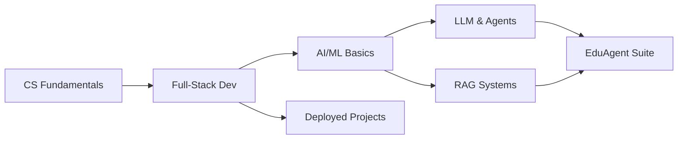

<div align="center">


<br/>

[](https://www.linkedin.com/in/sohan-kumar-sahu-186428345/)
[](mailto:sohankumarsahu246540@gmail.com)
[](https://www.codechef.com/users/kl_2400031488)
[](https://leetcode.com/u/kl2400031488)

</div>

---

## 🧠 About Me

> *"Build things that matter — because code is just the tool, the problem is the point. Still learning. Always building."*

I'm a 2nd-year B.Tech CSE (AI/ML) student at KL University (CGPA: 9.38/10) who builds AI-powered tools and full-stack platforms. I got into programming because I kept running into problems that felt solvable — so I started solving them.

- 🤖 Currently building **EduAgent Suite** — a multi-agent AI platform for students
- 🌱 Learning: **RAG architectures · LangGraph · Azure · Vibe Coding**
- 🏆 CodeChef **3-Star** (Rating: 1602) · Global Rank **271** in Starters 226
- 🚀 **Shortlisted** at AI for Bharat Hackathon 2025
- 🇮🇳 Competed at **Smart India Hackathon** (SIH 25071) — National Level
- ⚡ Fun fact: I name my agents before I build them

---

## 🛠️ Tech Stack

<div align="center">

### 💻 Languages


### 🤖 AI / LLM Stack


### 🌐 Frontend


### ⚙️ Backend & Databases


### 🔧 Tools & Cloud


</div>

---

## 🚀 Featured Projects

<div align="center">
<table>
<tr>
<td width="50%">

### 🤖 EduAgent Suite
**AI Multi-Agent Platform for Students**

```text
Stack: Python · LangChain · LangGraph
       Groq LLaMA 3 · FastAPI · React
Status: Live · In Progress
```

4 agents — CV Analyser, **Pathly** (learning paths), **Janasetu** (scholarships), **EduCompass** (college matcher) — orchestrated via LangGraph. One platform replacing 4 manual student workflows.

[](https://github.com/lazy0ne369)

</td>
<td width="50%">

### 💬 Enterprise Policy Chatbot
**RAG Pipeline over Company Documents**

```text
Stack: Python · LangChain · OpenAI API
       RAG · Vector DB · FastAPI · React
Status: Completed
```

End-to-end RAG pipeline with semantic search — instant, context-aware answers over unstructured policy documents. Replaced manual lookup entirely.

[](https://github.com/lazy0ne369)

</td>
</tr>
<tr>
<td width="50%">

### 📡 Rocksafe 360
**AI Disaster Prediction System**

```text
Stack: Python · ML · Real-time Pipeline
       Dashboard
Status: Deployed · SIH 25071
```

AI-driven rockfall prediction platform. Contributed REST API integration and UI/UX design of the live risk-zone dashboard at Smart India Hackathon.

[](https://github.com/lazy0ne369)

</td>
<td width="50%">

### 🚨 CARE — Crash Alert & Rescue Engine
**Embedded Safety System**

```text
Stack: Embedded C · Sensor Fusion
       Signal Processing
Status: Completed
```

Fault-tolerant embedded crash detection with automated emergency alert triggering. Sub-100ms response latency through robust sensor calibration.

[](https://github.com/lazy0ne369)

</td>
</tr>
</table>
</div>

---

## 💼 Who I Am in Code

```javascript
const sohan = {
    role: "AI/ML Student · Full-Stack Developer",
    university: "KL University, Vijayawada",
    cgpa: 9.38,
    languages: ["Python", "Java", "C++", "JavaScript", "C"],
    stack: {
        ai: ["LangChain", "LangGraph", "Groq LLaMA 3", "RAG", "OpenAI API"],
        frontend: ["React", "Next.js", "HTML5", "CSS3"],
        backend: ["FastAPI", "Spring Boot", "REST APIs"],
        databases: ["PostgreSQL", "MySQL"],
        tools: ["Git", "GitHub Copilot", "Linux", "Agile/Scrum"]
    },
    currentlyBuilding: "EduAgent Suite — multi-agent AI platform for students",
    learning: ["RAG architectures", "LangGraph", "Azure", "Vibe Coding"],
    motto: "Build things that matter — the problem is the point."
};
```

---

## 📊 GitHub Analytics

<div align="center">
  
  &nbsp;
  
</div>

<div align="center">
  
</div>

<div align="center">
  
</div>

---

## 🏆 Achievements & Highlights

<div align="center">

| 🏅 | Achievement | Details |
|:---:|:---|:---|
| 🌟 | CodeChef 3-Star | Rating 1602 · Global Rank **271** in Starters 226 |
| 🚀 | AI for Bharat Hackathon | **Shortlisted** (2025) |
| 🇮🇳 | Smart India Hackathon | SIH 25071 — National Level |
| ☁️ | Oracle Cloud | AI Foundations Associate |
| 🤖 | GitHub Copilot | Certified |
| 📚 | NPTEL | Introduction to Machine Learning |
| 🗣️ | Cambridge Linguaskill | English — CEFR B2 |

</div>

---

## 📚 My Learning Path



---

## 🤝 Let's Connect

<div align="center">

Always open to collaborating, building, or just a good conversation about AI.

[](https://www.linkedin.com/in/sohan-kumar-sahu-186428345/)
[](mailto:sohankumarsahu246540@gmail.com)
[](https://github.com/lazy0ne369)

### 💬 *"If you made it here — let's build something together 🚀"*

</div>

---

<div align="center">


---

**✨ curiosity + coffee = code ✨**

*Made with ❤️ and lots of ☕*

</div>
