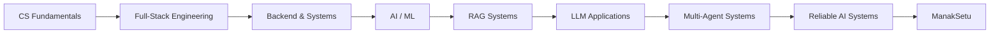

<!-- =========================================================
  LAZE // GitHub Profile README
  Designed as a hybrid of:
  - neofetch / terminal identity
  - neural / technical visual language
  - living GitHub telemetry
  - compact interactive details
========================================================= -->

<div align="center">

# `laze` / Sohan Kumar Sahu

### AI/ML × Backend × Full-Stack × Systems

> **I build things that matter — because code is just the tool, the problem is the point.**

[](https://github.com/lazy0ne369)
[](https://www.linkedin.com/in/sohan-kumar-sahu/)
[](mailto:sohankumarsahu246540@gmail.com)

</div>

---

## `> system.status`

```text
╭──────────────────────────────────────────────────────────────╮
│ LAZE.OS :: ENGINEERING PROFILE                              │
├──────────────────────────────────────────────────────────────┤
│ identity      →  Sohan Kumar Sahu                           │
│ role          →  AI/ML Engineer in progress                 │
│ education     →  B.Tech CSE (AI & ML) · KL University      │
│ performance   →  9.35 / 10 CGPA                            │
│ focus         →  AI Systems · RAG · Backend · DSA           │
│ current_mode  →  BUILDING                                   │
│ current_build →  ManakSetu                                  │
│ problem_bias  →  real users > toy demos                     │
│ uptime        →  learning continuously                      │
╰──────────────────────────────────────────────────────────────╯
```

I'm a second-year Computer Science (AI & ML) student who enjoys turning messy, real-world problems into **working systems**. My work sits at the intersection of **AI/ML, retrieval systems, backend architecture, full-stack engineering, and problem solving**.

I care less about adding another demo to the internet and more about answering:

> **Can this system be useful, explainable, reliable, and actually shipped?**

---

## `> currently.building`

### 🧭 ManakSetu — Evidence-Grounded AI for Indian Standards

**From questions → retrieval → evidence → answer.**

An independent engineering/research project exploring how RAG systems can answer technical and compliance-oriented questions while remaining grounded in evidence and honest about uncertainty.

```text
User Query
    ↓
Query Intelligence
    ↓
Hybrid Retrieval ── semantic + BM25
    ↓
RRF Fusion + Reranking
    ↓
Evidence Extraction + Confidence
    ↓
Citation-Aware Generation
    ↓
Validation
    ↓
Answer
```

**Highlights:** `54/54` automated benchmark pass · ~`506ms p50` · ~`619ms p95`

**Stack:** Python · FastAPI · Qdrant · Sentence-Transformers · BM25 · React

→ **[Explore ManakSetu](https://github.com/lazy0ne369/ManakSetu)** · **[Live App](https://manak-setu.vercel.app/)**

---

## `> selected.systems`

I like projects where the interesting part is not just the UI — it's the **engineering underneath it**.

| SYSTEM | WHAT I BUILT | STACK / SIGNAL |
| :--- | :--- | :--- |
| 🧭 **ManakSetu** | Evidence-grounded RAG assistant for Indian Standards & compliance | `FastAPI` `Qdrant` `BM25` `React` |
| 👴 **Yorisoi AI** | Multi-agent eldercare platform with real-time assistance and role-secured dashboards | `Next.js` `TypeScript` `Groq` `Gemini` `PostgreSQL` |
| ☀️ **HELIOS** | CNN + Transformer solar-flare forecasting with custom cross-attention + uncertainty estimation | `PyTorch` `Flask` `Aditya-L1` |
| 🛡️ **TrueDelivery** | AI parametric-insurance platform with risk assessment + fraud workflows | `Spring Boot` `React` `REST APIs` |
| 🧩 **Enterprise TaskFlow** | Microservices project-management system with auth, messaging, CI/CD & observability | `Java` `Spring Boot` `Kafka` `Redis` `Docker` |
| 🤖 **EduAgent / AgentNet direction** | Multi-agent student workflows spanning CVs, learning paths, opportunities & college discovery | `LangGraph` `LangChain` `FastAPI` `React` |
| 📡 **Rocksafe 360** | AI-assisted rockfall-risk platform with dashboard + API integration | `Python` `ML` `REST` |
| 🚨 **CARE** | Embedded crash detection + emergency-alert system | `Embedded C` `Sensor Fusion` `Signal Processing` |

<details>
<summary><b>🔍 Open the engineering notes</b></summary>

### ManakSetu
Query understanding, intent/entity extraction, hybrid retrieval, reciprocal-rank fusion, reranking, evidence extraction, confidence scoring, citation-aware generation, clarification handling, validation, and automated evaluation.

### Yorisoi AI
Four specialized agents for wellness, safety, care coordination, and care management, combined with a real-time assistant and role-specific dashboards. **Round 2 shortlisted — FarAway Hackathon.**

### HELIOS
A dual-branch CNN + Transformer forecasting pipeline using Aditya-L1 observations, a custom cross-attention mechanism, and Monte Carlo Dropout for uncertainty-aware predictions. Built for the **ISRO Bharatiya Antariksh Hackathon 2026**.

### TrueDelivery
Backend-heavy insurance workflow with automated risk assessment, fraud detection, REST APIs, and role-based interfaces. Built for **Guidewire DEVTrails 2026**.

### Enterprise TaskFlow
A distributed-systems-oriented build exploring microservices, JWT authentication, REST APIs, Kafka, Redis, CI/CD, automated testing, and observability with Spring Boot Actuator.

</details>

---

## `> tech.stack`

### Languages

`Python` `C++` `Java` `C` `JavaScript` `TypeScript` `SQL`

### AI / ML / GenAI

`PyTorch` `LangChain` `LangGraph` `RAG` `Qdrant` `Sentence-Transformers` `BM25` `Embeddings` `Gemini API` `Groq API` `Vertex AI` `MLOps`

### Backend / Distributed Systems

`FastAPI` `Spring Boot` `REST APIs` `PostgreSQL` `MySQL` `Redis` `Kafka` `Docker` `Socket.io` `WebRTC`

### Frontend / Product

`React` `Next.js` `HTML5` `CSS3` `Figma` `Canva`

### Engineering Tools

`Git` `GitHub` `GitHub Actions` `GitHub Copilot` `Linux` `AWS`

---

## `> engineering.philosophy`

```text
problem
  │
  ├── understand the user
  │
  ├── model the system
  │
  ├── build the smallest useful version
  │
  ├── measure it
  │
  ├── find what breaks
  │
  └── iterate until it deserves to ship
```

### Things I naturally gravitate toward

- **Evidence over hallucination** — retrieval, citations, validation, evaluation
- **Systems over demos** — APIs, architecture, latency, failure modes, deployment
- **Human usefulness** — accessibility, practical workflows, understandable interfaces
- **Algorithmic thinking** — DSA and competitive programming as a daily sharpening tool

---

## `> learning.path`



### Current focus

**RAG architectures · multi-agent orchestration · retrieval evaluation · backend scalability · cloud deployment · system design**

---

## `> experience.log`

### Data Analyst Intern — Midcentury Labs Inc.
`May 2026 → Jul 2026`

Worked on AI/ML data workflows involving large-scale data annotation and validation, annotation QA, and error analysis focused on downstream model reliability.

### Google Cloud Generative AI Virtual Internship — AICTE × EduSkills
`Apr 2026 → Jun 2026`

Completed an 8-week hands-on program covering LLMs, RAG, embeddings, Vertex AI, Gemini APIs, prompt engineering, and MLOps through applied projects.

---

## `> competitive_mode`

```text
CodeChef      →  ★★★   1602 max rating
Starters 226  →  Global Rank #271

Focus         →  arrays · strings · DP · graphs · trees
Mindset       →  solve → optimize → repeat
```

---

## `> achievements`

| SIGNAL | HIGHLIGHT |
| :--- | :--- |
| 🏆 | CodeChef 3-Star · Max Rating **1602** |
| 🥇 | Global Rank **271** in Starters 226 |
| 🛰️ | ISRO Bharatiya Antariksh Hackathon 2026 |
| 🚀 | Guidewire DEVTrails 2026 |
| 🇮🇳 | AI for Bharat Hackathon · Round 2 |
| 🇮🇳 | Smart India Hackathon · National Level |
| 🧠 | GitHub Copilot Certified |
| ☁️ | AWS Cloud Practitioner |
| ☁️ | Oracle Cloud Infrastructure AI Foundations |
| 📚 | NPTEL — Introduction to Machine Learning |
| 🗣️ | Cambridge Linguaskill English · CEFR B2 |

---

## `> github.telemetry`

<div align="center">


</div>

<div align="center">


</div>

---

## `> beyond.the.code`

### Leadership

**Technical Wing — Forge Student Body**  
**Design Team — Esports Club**  
**Former Member — CIIE Student Body**

### Languages

`English` · `Hindi` · `Odia` · `Japanese (learning)`

### Interests

`AI Systems` · `Software Engineering` · `Open Source` · `Competitive Programming` · `Photography` · `Gaming`

---

## `> inspect.developer`

<details>
<summary><b>Open the manifest</b></summary>

```js
const laze = {
  identity: {
    name: "Sohan Kumar Sahu",
    handle: "lazy0ne369",
    role: "AI/ML Engineer in progress",
    university: "KL University"
  },

  build: {
    current: "ManakSetu",
    interests: [
      "AI systems",
      "RAG",
      "multi-agent workflows",
      "backend architecture",
      "real-time systems"
    ]
  },

  stack: {
    primary: ["Python", "Java", "C++", "TypeScript"],
    ai: ["PyTorch", "LangChain", "LangGraph", "Qdrant", "RAG"],
    web: ["React", "Next.js", "FastAPI", "Spring Boot"],
    infra: ["Docker", "Kafka", "Redis", "AWS", "GitHub Actions"]
  },

  engineering_bias: "evidence > vibes",
  default_mode: "build",
  current_problem: "How do we make AI systems more useful and trustworthy?",
  motto: "The problem is the point."
};
```

</details>

---

## `> connect`

<div align="center">

**Building something interesting? Working on AI, backend systems, or open source?**

[](https://www.linkedin.com/in/sohan-kumar-sahu/)
[](https://github.com/lazy0ne369)
[](mailto:sohankumarsahu246540@gmail.com)

<br>

> **Curiosity → Build → Break → Learn → Ship → Repeat.**

</div>

<!-- Keep the profile intentional. Add new projects only when they strengthen the story. -->